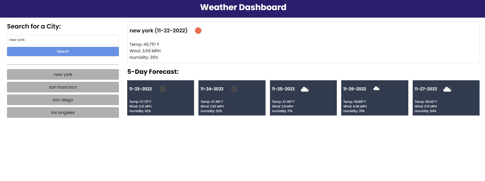

# weather-dashboard
Enter in your city of choice and select search to view the current weather and forecast for the next five days.Previous searches are saved in localStorage and search histories are available as buttons in order for easy access and re-searching of weather and forecasts.

##When viewing current weather conditions for the city, the following is shown:

## City name
## Date
## An icon representation of weather conditions
## Temperature
## Humidity
## Wind speed
The application leverages OpenWeather API to pull weather and forecast informaton for cities across the US and provides updated weather data and forecasting to help you anticipate and prepare for your trip.
## Installation
N/A

## Usage

## Credits
N/A
## Websites 
https://mary90272.github.io/weather-dashboard/
